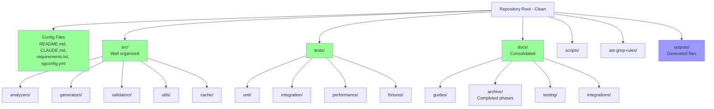

# Repository Organization Analysis

*Generated: 2025-12-08*
*Updated: 2025-12-09 (Phase 5B/5C Complete)*

## Executive Summary

| Metric | Value |
|--------|-------|
| Files analyzed | 112 |
| Directories | 30 |
| Generated files (root) | ~38MB |
| Duplicates found | 2 |
| Removal candidates | 18+ |

## Current Structure

```mermaid
graph TD
    root[Repository Root<br/>112 files, 30 dirs]

    %% Root level clutter - RED (issues)
    root --> root_json[Root JSON Files<br/>11 files, 37MB+]
    root --> root_md[Root MD Files<br/>CLAUDE.md, README.md,<br/>PHASE_3_ROADMAP.md,<br/>PUSH_SUCCESS.md]
    root --> root_txt[Root TXT Files<br/>4 files]

    %% Source code - GREEN (well organized)
    root --> src[src/<br/>15 Python files]
    src --> analyzers[analyzers/<br/>5 files]
    src --> generators[generators/<br/>5 files]
    src --> validators[validators/<br/>2 files]
    src --> utils[utils/<br/>4 files]
    src --> cache[cache/<br/>2 files]

    %% Tests - GREEN
    root --> tests[tests/<br/>14 files]
    tests --> unit[unit/<br/>7 test files]
    tests --> integration[integration/<br/>5 test files]
    tests --> performance[performance/<br/>1 file]
    tests --> fixtures[fixtures/<br/>5 fixture files]

    %% Docs - YELLOW (needs cleanup)
    root --> docs[docs/<br/>22 MD files]
    docs --> archive[archive/<br/>5 files]
    docs --> guides[guides/<br/>5 files]
    docs --> summaries[summaries/<br/>9 files]
    docs --> testing[testing/<br/>3 files]
    docs --> integrations[integrations/<br/>2 files]
    docs --> refactoring[refactoring/<br/>2 files]
    docs --> examples[examples/<br/>2 files]

    %% Other directories
    root --> scripts[scripts/<br/>5 files]
    root --> ast_rules[ast-grep-rules/<br/>3 YAML files]
    root --> outputs[outputs/<br/>empty subdirs]
    root --> inventory[Inventory/<br/>1 file]

    %% Styling
    style root_json fill:#ff9999
    style root_txt fill:#ff9999
    style root_md fill:#ffeb99
    style inventory fill:#ff9999
    style docs fill:#ffeb99
    style summaries fill:#ffeb99
    style src fill:#99ff99
    style tests fill:#99ff99
    style analyzers fill:#99ff99
    style generators fill:#99ff99
```



## Key Issues Identified

### 1. Root Directory Clutter (HIGH PRIORITY)

**Problem**: 11 JSON files (37MB+) and 4 TXT files at root that are generated outputs.

| File | Size | Status |
|------|------|--------|
| `schemas.json` | 36MB | Gitignored, delete locally |
| `schemas_enhanced.json` | 132KB | Gitignored, delete locally |
| `quality.json` | 196KB | Gitignored, delete locally |
| `quality_after_logging.json` | 232KB | Gitignored, delete locally |
| `quality_complete.json` | 216KB | Gitignored, delete locally |
| `quality_final.json` | 272KB | Gitignored, delete locally |
| `quality_final.txt` | 144KB | Gitignored, delete locally |
| `analyticsbot_quality.json` | 552KB | Gitignored, delete locally |
| `analyticsbot_quality.txt` | 252KB | Gitignored, delete locally |
| `coverage.json` | 192KB | Gitignored, delete locally |
| `test_results.json` | 4KB | Gitignored, delete locally |
| `test_results.txt` | 4KB | Gitignored, delete locally |
| `pre_migration_tests.txt` | 32KB | Gitignored, delete locally |

### 2. Tracked Files That Should Be Removed

| File | Reason | Action |
|------|--------|--------|
| `PUSH_SUCCESS.md` | Obsolete status report from Nov 1, 2025 | Remove from git |
| `PHASE_3_ROADMAP.md` | Completed roadmap | Move to docs/archive/ |
| `README_ENHANCED.md` (9 files) | Auto-generated, should be gitignored | Untrack from git |

### 3. Duplicate Content

| Original | Duplicate | Action |
|----------|-----------|--------|
| `./schemas_enhanced.json` | `Inventory/schemas_enhanced.json` | Delete Inventory/ directory |

### 4. Documentation Sprawl

**docs/summaries/** contains phase summary files:

- PHASE_1_COMPLETE.md
- PHASE_2_COMPLETE.md
- PHASE_3_COMPLETE.md
- PHASE_3_GIT_SUMMARY.md (duplicate of PHASE_3_COMPLETE)
- PHASE_3_SUMMARY.md (duplicate of PHASE_3_COMPLETE)
- PHASE_4_COMPLETE.md
- PHASE_5B_COMPLETE.md (Dashboard Personalization)
- PHASE_5C_COMPLETE.md (Dark Mode, Data Export)
- FINAL_SUMMARY.md
- IMPROVEMENTS_SUMMARY.md
- SCHEMA_SUMMARY.md
- TEST_COVERAGE_SUMMARY.md

**Recommendation**: Consolidate PHASE_3_*.md files into one comprehensive document.

## Recommended Structure



## Migration Plan

### Phase 1: Remove Tracked Files (Executed)

```bash
# Remove obsolete status file
git rm PUSH_SUCCESS.md

# Remove auto-generated README_ENHANCED.md files from tracking
git rm --cached src/validators/README_ENHANCED.md
git rm --cached tests/fixtures/README_ENHANCED.md
git rm --cached tests/integration/README_ENHANCED.md
git rm --cached tests/unit/README_ENHANCED.md

# Move completed roadmap to archive
git mv PHASE_3_ROADMAP.md docs/archive/PHASE_3_ROADMAP.md
```

### Phase 2: Update Gitignore (Executed)

Added `.mypy_cache/` pattern to .gitignore.

### Phase 3: Clean Local Generated Files

```bash
# Remove large generated files from root (already gitignored)
rm -f schemas.json schemas_enhanced.json
rm -f quality*.json quality*.txt
rm -f analyticsbot_quality.json analyticsbot_quality.txt
rm -f coverage.json test_results.json test_results.txt
rm -f pre_migration_tests.txt

# Remove duplicate output directory
rm -rf Inventory/

# Remove local README_ENHANCED.md files
find . -name "README_ENHANCED.md" -type f -delete
```

## Benefits

- **Reduced clutter**: ~38MB of generated files removed from root
- **Cleaner git history**: No more auto-generated files in commits
- **Better discoverability**: Clear separation of source, tests, docs
- **Consistent organization**: All generated outputs in outputs/

## Files to Keep at Root

| File | Purpose |
|------|---------|
| `README.md` | Project documentation |
| `CLAUDE.md` | AI assistant context |
| `requirements.txt` | Python dependencies |
| `requirements-test.txt` | Test dependencies |
| `package.json` | Node.js configuration |
| `sgconfig.yml` | ast-grep configuration |
| `mypy.ini` | Type checking configuration |
| `.gitignore` | Git ignore patterns |

## Maintenance Recommendations

1. **Weekly**: Run `find . -name "README_ENHANCED.md" -delete` to clean auto-generated files
2. **Before commits**: Ensure no generated files in staging area
3. **Periodically**: Review docs/summaries/ for consolidation opportunities
4. **On new features**: Keep generated outputs in outputs/ directory

---

*This document was generated using the repository-organization-analyzer skill.*
